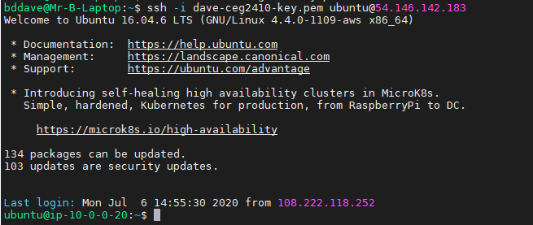

# CEG2410-Project1

- Name:  Brandon Dave
- Email:  dave.15@wright.edu

1. What is your Discord username?  
  Ganon#9652 nicknamed Brandon Dave
  
2. What is your GitHub username?  
  BDDave-Student
  
3. What is the IP for your Ubuntu Linux server?  
  Public: 54.146.142.183  
  Private:  10.0.0.20
  
4. What command did you use to ssh in to your Linux server?  
  ssh -i dave-ceg2410-key.pem ubuntu@54.146.142.183  
  
5. What port does ssh use?   
  22

6. Insert a screenshot here of your successful connection  
  
  
7. What is the IP for your Windows 2019 server?  
  54.165.211.157
  
8. What remote desktop software did you use to connect to your Windows Server?  
  Remote Desktop Connection
  
9. What port does RDP use?  
3389

10. Insert a screenshot here of your successful connection  

### Provide a description of the following commands

11. `git clone`:   "Clone" an existing repository into working directory

12. `git add`:   "Add" current working specified file or files as a "version" to be added for committing changes

13. `git commit`:  "Commit" working changes into the active branch or repository.

14. `git push`:  Updates working files into chain of development to be sent to the final development phase.

15. Create a **clickable** link to your git cheatsheat of choice (you may use mine):  [Cheat Sheet](git-guide.md)

## Useful links:

- [CEG 2410 AWS Setup Guide](https://github.com/pattonsgirl/Spring2021-CEG2410/blob/main/AWS-Setup-Guide.md)
- [GitHub Guide for Mastering Markdown](https://guides.github.com/features/mastering-markdown/)

